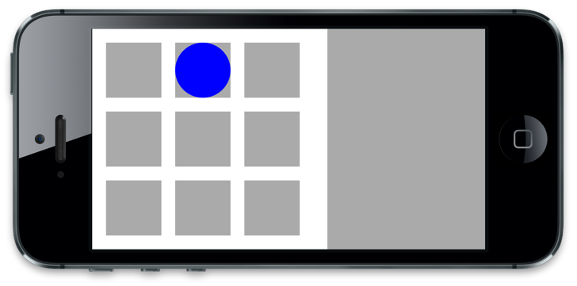
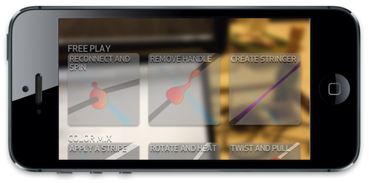

BuzzBox
=======

iPhone component of final project for the Winter 2012-2013 rendition of Stanford e281: dmedia.

BuzzBox is an interactive instruction manual of sorts to be used while flameworking. 
The flameworker is expected to mount their iPhone on their torch, 
whereupon they will control BuzzBox by moving their hands/the glass rod in front 
of the iPhone's camera. You can see a prototype [here](http://dschool.stanford.edu/dmedia/buzzbox-prototype/), 
and a video of the system in action [here](http://vimeo.com/62533218). 

This was developed in the space of two weeks, though, so BuzzBox is 
_actually_ operated by a second iPhone over the local WiFi network. The flameworker 
uses BuzzBox in "projection" mode, while a confederate operates BuzzBox in 
["wizard" mode](http://en.wikipedia.org/wiki/Wizard_of_Oz_experiment). 
These instances of BuzzBox will automatically pair so long as they're on the 
same network. The projection will then display a live feed from the iPhone's 
rear camera, whereas the wizard will display an interface that looks like this: 

The wizard's interface maps directly onto the projection's interface: touching and holding 
the big gray box on the right side of the wizard's interface (the 
["dead man's switch"](http://en.wikipedia.org/wiki/Dead_man%27s_switch)) will 
cause a 3x3 grid of video clips to appear on the projection's interface 
(flameworker's hands/glass rod not shown):

While continuing to hold the dead man's switch, you can drag the blue dot--representing 
the centerpoint of the glass rod held by the flameworker--throughout the grid, 
and the grid shown by the projection will pan; holding your finger/the dot on a 
grid square will cause the corresponding video clip shown by the projection to 
play. Releasing the dead man's switch will cause the project's grid to fade, and 
be replaced by an illustration of the last clip viewed. Bring up the grid again 
by holding the dead man's switch, etc.

The above navigation mechanic is explained to the flameworker 
(with reference to the movement of their hands--they show/hide the grid by 
moving the rod closer to/farther away from the camera, and pan through the grid 
by moving the rod up/down/left/right) through a tutorial which they begin 
by tapping, once, on the video feed shown by the projection. Thereafter, the 
projection is hands-off: the wizard's operator is supposed to observe and track 
the flameworker's hands _as if_ the projection's iPhone was doing so.

Running BuzzBox
---------------

The best way to use BuzzBox is, as you might expect, with two iDevices. 
But you can get by, with a loss of just a little bit of flexibility, 
by running the wizard in the simulator and the projection on an attached 
iDevice. (Rather, you need to attach an iDevice once to deploy the application, 
and thereafter the iDevice just has to be on the same Wi-Fi network.)

If you set ONE_HANDED_WIZARD (in BBWizardViewController.h) to 1, then 
the dead man's switch will be "held" while the blue dot is being dragged.
This allows the wizard to be operated with only one hand: the interface 
shows while you drag the dot through the grid of videos, and hides 
when you lift your finger.
